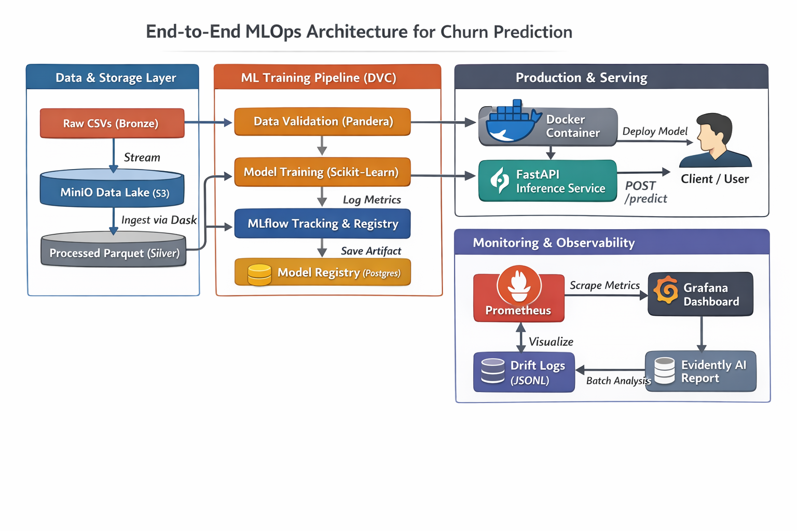
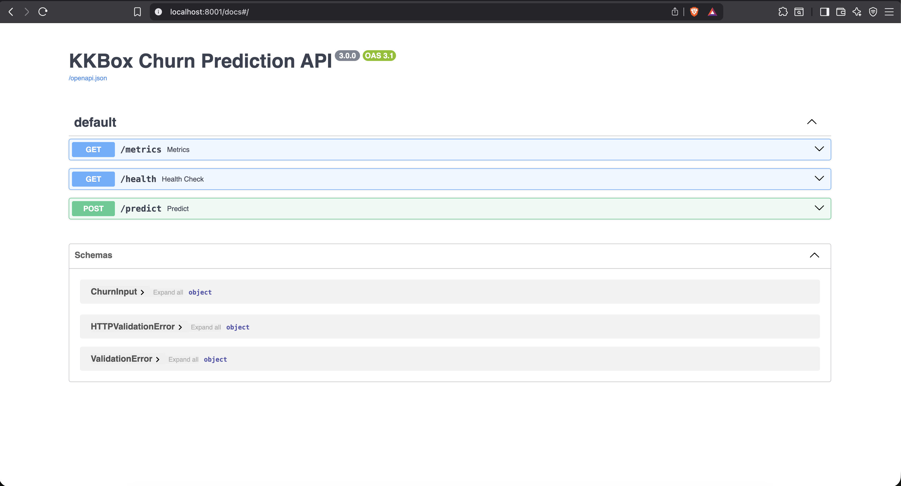
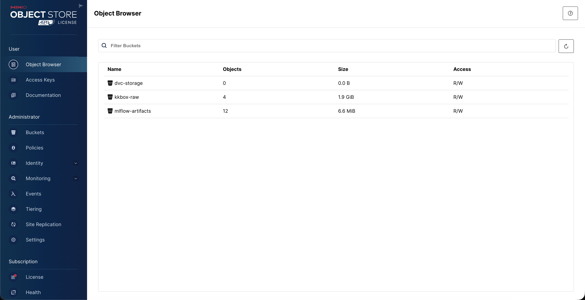
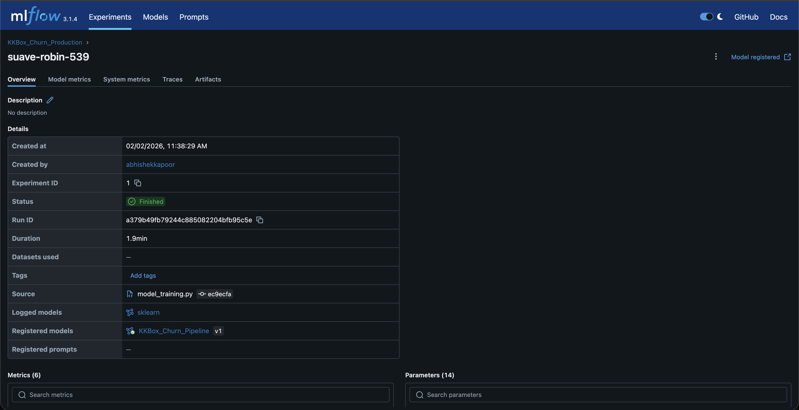
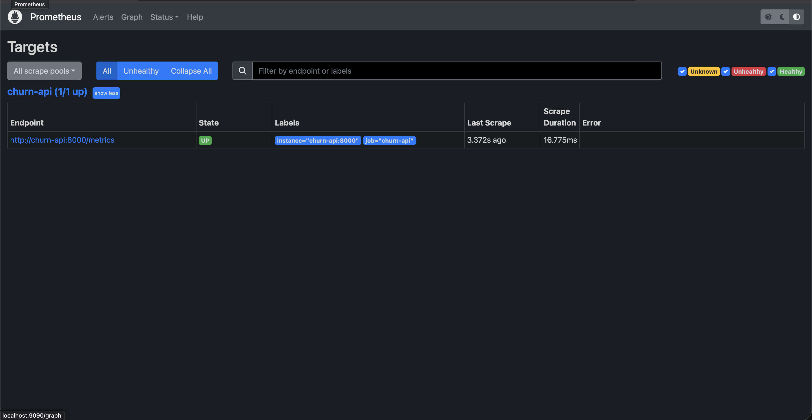
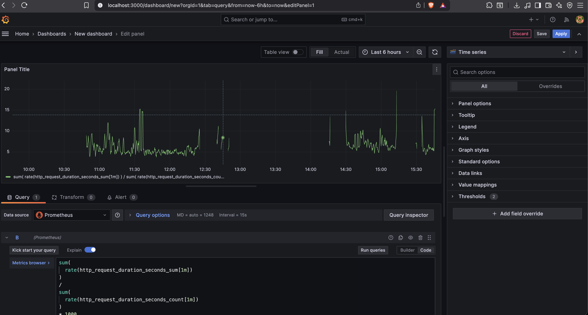

# KKBox Music Streaming Churn Predictor

### End-to-End MLOps Platform for Real-Time Churn Prediction

**Architecture Level: MLOps**  
**(Automated Pipelines, CI/CD, Continuous Monitoring)**

---

## 1. Overview

This project implements a production-grade Machine Learning system to predict user churn for a music streaming platform. Unlike notebook-based ML projects, this repository focuses on system design, automation, reproducibility, and observability across the entire ML lifecycle.

The platform follows a Lakehouse-style architecture, supports large-scale data processing, enforces training–serving consistency, and exposes predictions through a containerized FastAPI service with real-time monitoring.

The entire stack is locally reproducible, cloud-portable, and designed with real production constraints in mind.

---

## 2. System Architecture

The system is composed of four major layers:
*   Data & Storage
*   Model Training & Experimentation
*   Production Inference
*   Monitoring & Observability

**High-Level Architecture Diagram**

<p align="center">
  
</p>

---

## 3. Technology Stack

### Languages
*   Python 3.9+

### Data Engineering
*   Dask (distributed processing)
*   Pandas, PyArrow
*   MinIO (S3-compatible object storage)

### Machine Learning
*   LightGBM
*   Scikit-learn Pipelines
*   Imbalanced-learn

### MLOps & Reproducibility
*   MLflow (experiment tracking and model registry)
*   DVC (data versioning)
*   PostgreSQL (metadata store)

### Deployment
*   Docker, Docker Compose
*   FastAPI, Uvicorn
*   Pydantic

### Monitoring & Quality
*   Prometheus (metrics collection)
*   Grafana (visualization)
*   Evidently AI (data drift detection)
*   Pandera (schema validation)

### CI/CD & Tooling
*   GitHub Actions
*   Docker Hub
*   Makefile
*   Pytest, Flake8

---

## 4. Data Pipeline Design

### Phase 1: Data Ingestion (Lakehouse Pattern)
*   Raw user activity logs stored as Bronze CSVs in MinIO.
*   Chunked streaming using s3fs and Dask.
*   Type normalization and compression to Parquet.
*   Optimized Silver Parquet files tracked using DVC.

This avoids loading the full dataset into memory while preserving reproducibility.

### Phase 2: Feature Engineering (Distributed Computing)
*   Aggregated 100M+ log rows into user-level features.
*   Generated behavioral and trend-based metrics.
*   Reduced transactional history into a static Gold feature table.

This significantly improves training speed and inference stability.

### Phase 3: Zero-Skew Training Pipeline
To prevent training–serving skew:
*   Custom Scikit-learn transformer encapsulates all feature logic.
*   Preprocessing + scaling + LightGBM combined into a single Pipeline.
*   Serialized and loaded directly by the API.

The inference service never reimplements feature logic.

### Phase 4: Data Validation & Testing
*   Pandera enforces schema rules before training.
*   Pytest validates feature logic and API health.
*   Edge cases (e.g., division by zero) explicitly tested.

---

## 5. Production Deployment

### FastAPI Inference Service
The trained model is served via a FastAPI application running inside a Docker container.

<p align="center">
  
</p>

### Object Storage (MinIO)
MinIO acts as a local S3-compatible data lake for raw and processed datasets.

<p align="center">
  
</p>

---

## 6. Experiment Tracking & Model Registry

All experiments, metrics, and model artifacts are tracked using MLflow.

<p align="center">
  
</p>

This enables full traceability between:
*   Code version (Git commit)
*   Data version (DVC hash)
*   Model version (MLflow run)

---

## 7. Monitoring & Observability

### Prometheus Metrics
Prometheus scrapes application metrics such as request count and latency.

<p align="center">
  
</p>

### Grafana Dashboards
Grafana visualizes real-time system health, including API latency and throughput.

<p align="center">
  
</p>

### Data Drift Monitoring
Live inference inputs are asynchronously logged and analyzed offline using Evidently AI to detect shifts in user behavior over time.

---

## 8. Repository Structure

```text
kkbox_churn_pipeline/
├── .github/workflows/
│   └── ci.yaml
├── config/
│   ├── config.yaml
│   └── params.yaml
├── data/                     # Git-ignored local cache
│   ├── raw/                  # Bronze
│   ├── processed/            # Silver
│   ├── featured/             # Gold
│   └── live_traffic.jsonl
├── docker/
│   ├── Dockerfile.api
│   ├── Dockerfile.mlflow
│   └── prometheus.yml
├── screenshots/              # README assets
│   ├── architecture.png
│   ├── grafana.png
│   ├── prometheus.png
│   ├── mlflow.png
│   ├── mini-io.png
│   └── fastapi.png
├── src/
│   └── components/
├── tests/
├── app.py
├── docker-compose.yaml
├── dvc.yaml
├── Makefile
├── requirements.txt
└── README.md
```

---

## 9. Future Improvements
*   Kubernetes-based horizontal scaling.
*   Feature Store integration (e.g., Feast).
*   Online A/B testing with challenger models.
*   Canary deployments for model rollouts.
