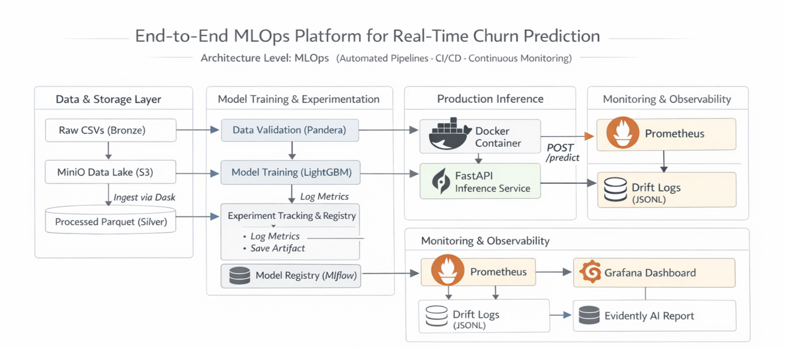
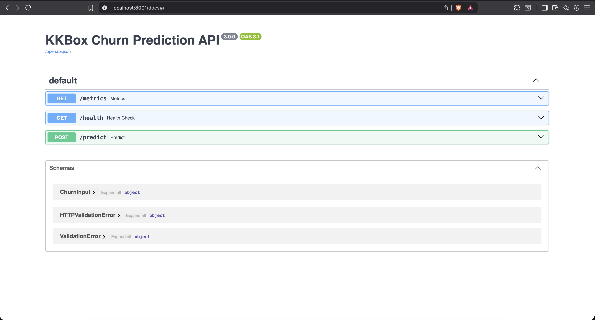
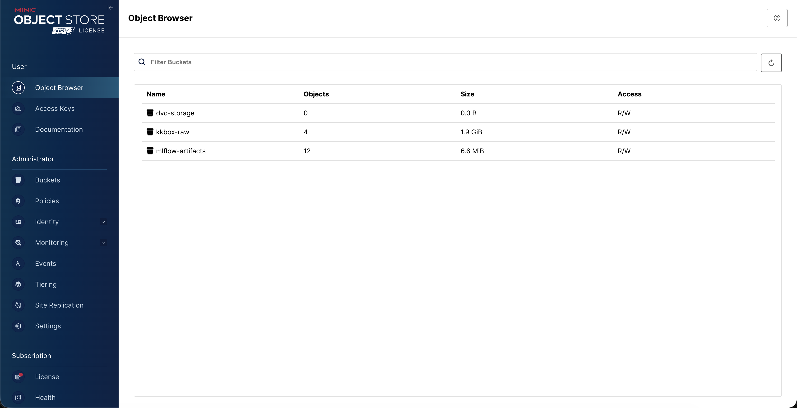
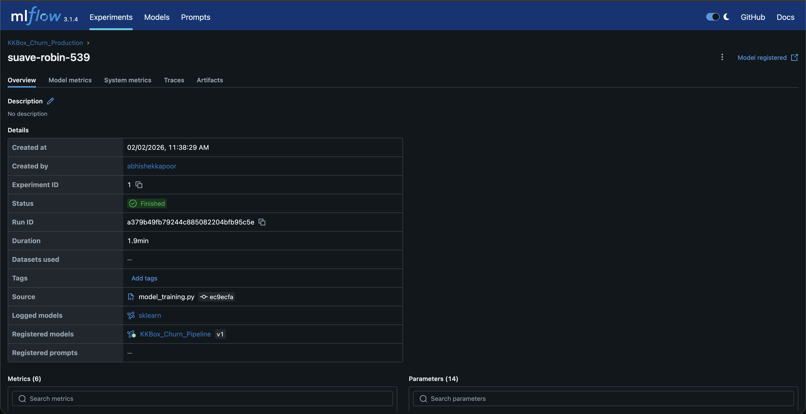
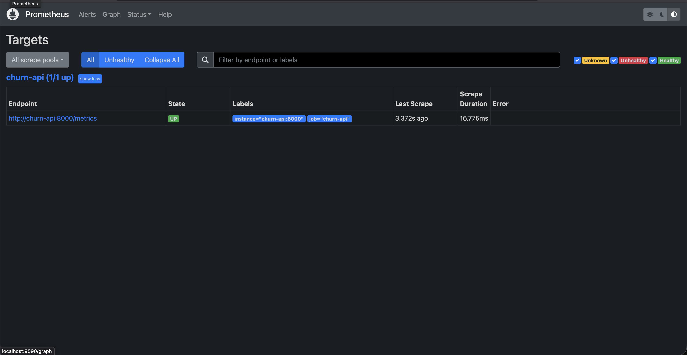
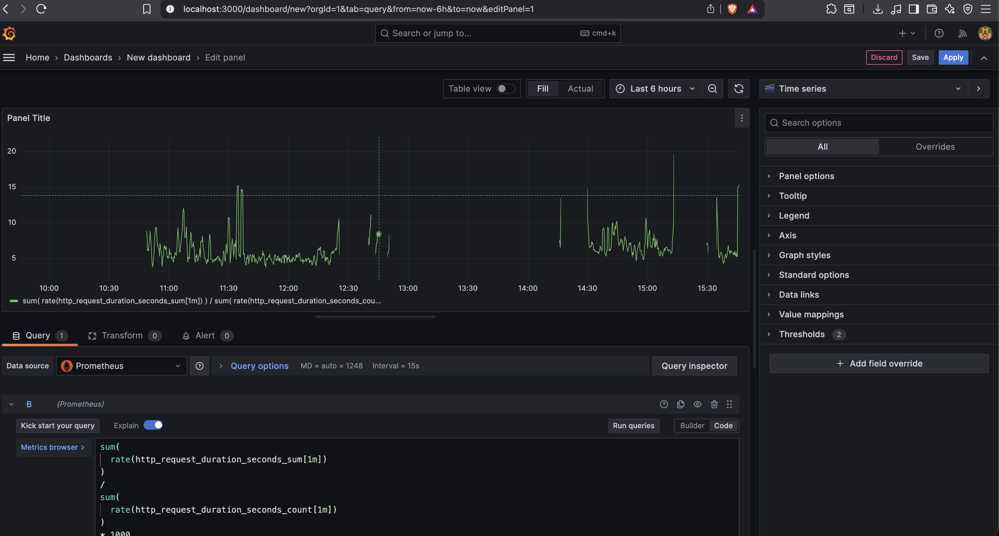

## End-to-End MLOps Platform for Real-Time Churn Prediction

**Architecture Level: MLOps**  
**(Automated Pipelines, CI/CD, Continuous Monitoring) Via Github Actions & Dockerhub**

  
  
  
  
  
  
  
  
  
  

---

## 1. Executive Summary & Business Problem

This project implements a production-grade Machine Learning system to predict user churn for a music streaming platform (KKBOX dataset). Unlike notebook-based ML projects, this repository focuses on system design, automation, reproducibility, and observability across the entire ML lifecycle.

Many subscription-based businesses incorrectly assume that a lack of interaction signifies incoming churn, or that aggressive promotions strictly retain users. This project tackles the complexities of **subscriber churn prediction** through advanced feature engineering and behavioral segmentation, challenging conventional wisdom with hard data.

---

## 2. Business Insights & Discoveries

By observing almost **1 million subscribers**, we extracted non-intuitive but highly actionable insights. Based on the official KKBox problem framing, the definition of churn is remarkably specific: **Churn is defined as no new valid service subscription within 30 days after the current membership expires**. 

For this project ecosystem:
- The target (`train_v2`) is explicitly defined for the cohort of users whose subscriptions expire strictly in **March 2017**. 
- All behavioral predictive features are rigorously snapshotted at **February 28, 2017** to prevent target leakage. Anything from March 2017 onward is completely hidden during prediction.

### A. The "Ghost" User Paradox
Users with zero transactions in our active observation window (Ghost Users) exhibited an **8.06%** churn rate, whereas highly active users (1+ transactions) churned at a much higher **17.81%**. 
*Insight:* In this dataset, "Ghost" users often represent accounts that have already churned long ago (no recent transactions) or are on indefinite free tiers. Active interaction in music streaming often precedes subscription modifications or competitive switching. True retention efforts should focus on users showing volatile engagement drops, not just the permanently dormant.

### B. Promotional Sensitivity is Toxic to Retention
Subscriptions built purely on promotions are incredibly fragile.
- Users with **0 promotional transactions**: ~8.95% churn.
- Users with **1-2 promotional transactions**: ~88.47% churn.
- Users with **>2 promotional transactions**: **100% churn.**
*Insight:* Users hunting for promotions are virtually guaranteed to churn when requested to pay full price. The business should limit deep sequential discounting to prevent training users to churn the moment standard pricing kicks in.

### C. Active Cancellation (`is_cancel`) vs True Churn Behavior
A critical domain discovery is that clicking "cancel" (`is_cancel`) does **not** intrinsically equate to true churn. A user may cancel their service subscription merely to change service plans (e.g., from an active billing cycle to a long-term promotion). 
*Insight:* Therefore, the model's `cancel_rate` feature doesn't simply leak the target. Instead, it gauges the user's historical subscription volatility leading up to the target month of March. Many users actively cancel in one entry, only to extend their membership immediately after with a different plan.

### C. The Auto-Renew Trap
While auto-renewals stabilize baseline revenue, users in our dataset exhibiting manual renewal behavior showed lower churn (8.53%) than majority auto-renew segments (13.72%). 
*Insight:* This anomaly often suggests that manual renewers represent hyper-loyal active buyers, while auto-renew flags can be associated with "set-and-forget" users who eventually cancel en masse during billing audits.

### D. Dominant Payment Methods
The vast majority of our revenue flows through specific regional gateways. Payment Method `41` dwarfs all others (nearly **696,000** usages), followed by methods `39` (**137,000**) and `38` (**115,000**). 
*Insight:* Optimizing UX friction and payment success rates on Gateway 41 is a top priority for retention, as payment failure on this node would catastrophically impact the bottom line.

---

## 3. Data Cleaning, Assumptions & Engineering

A machine learning system is only as good as the domain knowledge encoded into its features. We approached the KKBox event dataset with rigorous temporal snapshotting.

### Assumptions & Data Handling Constraints
- **The Temporal Window & Training Cohort**: As defined by KKBox, the training data evaluated concerns users whose subscriptions expire **between 2017-03-01 to 2017-03-31**. The test split (typically for April) functions identically via `transactions_v2.csv` extended up to 3/31/2017.
- **Strict Leakage Barricade**: We establish a hard snapshot at **2017-02-28**. Although a user might shift their expiration date back and forth via cancellations and renewals in March, our model must predict the 30-day survival purely on metrics generated before February 28th.
- **Handling Complex Renewals**: A user may actively cancel on March 15th, moving their expiration back to March 16th, but resubscribe to a two-month plan on April 1st (within the 30 days). Our models trust the `is_churn` ground truth labels supplied by KKBox, but internally depend on the `total_cancel_count` metric developed from historical transactions to weigh the likelihood of such complex reversals.
- **Age (`bd`) Regularization**: Ages <= 0 (or outliers like -7000) or > 100 were nullified to address extreme garbage inputs mentioned in the data distribution. Missing ages were thoughtfully imputed using the training aggregate median (28.0) to preserve distribution shape without introducing future knowledge.
- **Handling Extreme Recency Dates**: `days_since_last_transaction` evaluates behavior proximity up to Feb 28th. Users without history defaulted to `-1` to explicitly route missing branches gracefully in the LightGBM models.
- **Ghost Segment Clipping**: Extreme outliers in daily listening times were clipped to $24 \times 60 \times 60$ seconds, removing physically impossible user logs (e.g., streaming for 30 hours in one day, likely bot or shared-account activity).

### Advanced Feature Engineering
We distilled 100M+ raw user, transaction, and log rows down to 36 potent aggregated features via Dask:
1. **Engagement Velocity (`recent_activity_ratio`)**: Compares active days in the most recent 30-day window against the previous 30 days. This explicitly captures accelerating or decelerating usage trends.
2. **Value Attrition (`cancel_rate` & `promo_ratio`)**: Users routinely cancelling or hunting promotions are flagged not just by count, but by the ratio of these actions to their total footprint (`total_cancel_count / total_transactions`).
3. **Consumption Depth (`completion_rate`)**: Instead of raw songs played, calculating the percentage of songs listened to 100% completion perfectly measures user satisfaction with the platform's recommendation algorithms.
4. **RFM Vectors**: Built high-level categorical segments (Champions, Lost, Discount Sensitive) directly mapping Recency, Frequency, and Monetary scores (Ranked 1-5).

---

## 4. System Architecture

The platform follows a Lakehouse-style architecture, supports large-scale data processing, enforces training–serving consistency, and exposes predictions through a containerized FastAPI service with real-time monitoring.

The system is composed of four major layers:
*   Data & Storage
*   Model Training & Experimentation
*   Production Inference
*   Monitoring & Observability

**High-Level Architecture Diagram**

  

---

## 5. Technology Stack

### Languages
*   Python 3.9+

### Data Engineering
*   Dask (distributed processing)
*   Pandas, PyArrow
*   MinIO (S3-compatible object storage)

### Machine Learning
*   LightGBM
*   Scikit-learn Pipelines
*   Imbalanced-learn

### MLOps & Reproducibility
*   MLflow (experiment tracking and model registry)
*   DVC (data versioning)
*   PostgreSQL (metadata store)

### Deployment
*   Docker, Docker Compose
*   FastAPI, Uvicorn
*   Pydantic

### Monitoring & Quality
*   Prometheus (metrics collection)
*   Grafana (visualization)
*   Evidently AI (data drift detection)
*   Pandera (schema validation)

### CI/CD & Tooling
*   GitHub Actions
*   Docker Hub
*   Makefile
*   Pytest, Flake8

---

## 6. Data Pipeline Design & MLOps

### Phase 1: Data Ingestion (Lakehouse Pattern)
*   Raw user activity logs stored as Bronze CSVs in MinIO.
*   Chunked streaming using s3fs and Dask.
*   Type normalization and compression to Parquet.
*   Optimized Silver Parquet files tracked using DVC.

This avoids loading the full dataset into memory while preserving reproducibility.

### Phase 2: Distributed Feature Engineering
*   Aggregated 100M+ log rows into user-level features.
*   Generated behavioral and trend-based metrics.
*   Reduced transactional history into a static Gold feature table.

### Phase 3: Zero-Skew Training Pipeline
To prevent training–serving skew:
*   Custom Scikit-learn transformer encapsulates all feature logic.
*   Preprocessing + scaling + LightGBM combined into a single Pipeline.
*   Serialized and loaded directly by the API.

The inference service never reimplements feature logic.

### Phase 4: Data Validation & Testing
*   Pandera enforces schema rules before training.
*   Pytest validates feature logic and API health.
*   Edge cases (e.g., division by zero) explicitly tested.

### Phase 5: Local EDA & Segmentation
*   `src/components/segmentation_analysis.py` builds local RFM segments, PCA projections, KMeans clusters, and DBSCAN anomaly samples.
*   `streamlit_app.py` exposes an interactive workbench for EDA, segment review, cluster inspection, and local model scoring.

---

## 7. Production Deployment & Serving

### FastAPI Inference Service
The trained model is served via a FastAPI application running inside a Docker container.

  

### Object Storage (MinIO)
MinIO acts as a local S3-compatible data lake for raw and processed datasets.

  

---

## 8. Experiment Tracking & Model Registry

All experiments, metrics, and model artifacts are tracked using MLflow. This enables full traceability between:
*   Code version (Git commit)
*   Data version (DVC hash)
*   Model version (MLflow run)

  

---

## 9. Monitoring & Observability

### Prometheus Metrics
Prometheus scrapes application metrics such as request count and latency.

  

### Grafana Dashboards
Grafana visualizes real-time system health, including API latency and throughput.

  

### Data Drift Monitoring
Live inference inputs are asynchronously logged and analyzed offline using Evidently AI to detect shifts in user behavior over time.

---

## 10. Future Improvements
*   Kubernetes-based horizontal scaling.
*   Feature Store integration (e.g., Feast).
*   Online A/B testing with challenger models.
*   Canary deployments for model rollouts.
